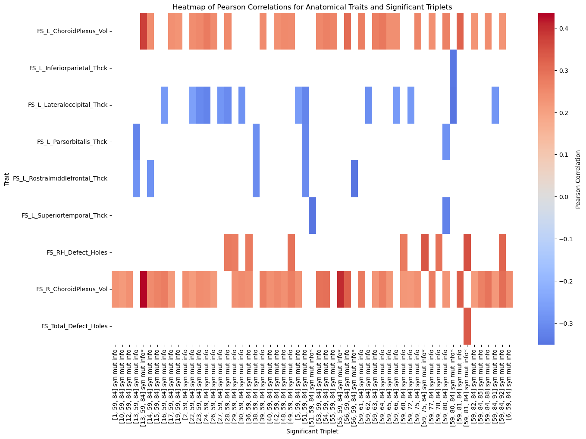

# High-Order Triplet Analysis and Relation with Behavioral Anatomical HCP Data (Restricted)

This codeblock is dedicated to the analysis of high-order triplet data in relation to behavioral and anatomical traits, specifically gait speed, using data from the Human Connectome Project (HCP). The workflow involves several key steps designed to organize, normalize, and analyze the data, with the goal of uncovering meaningful relationships between brain connectivity patterns and behavioral as well as anatomical outcomes.

The process is structured as follows:

1. **Data Preparation:** Reading high-order connectivity data and filtering the subject information to include only participants listed among the 100 unrelated individuals.
2. **Data Integration:** Loading and merging high-order triplet data from multiple multivariate interdependence metrics based on information theory, ensuring a comprehensive dataset for analysis.
3. **Data Normalization:** Normalizing the data across subjects to facilitate accurate comparisons.
4. **Mean Dataframe Creation:** Aggregating the data to create a mean dataframe representing the high-order connectivity profiles of all individuals.
5. **Data Filtering:** Filtering the data based on specific triplets identified as significant in previous analyses, preparing the dataset for clinical analysis.
6. **Statistical Analysis:** Performing linear regression to analyze the relationship between high-order hubs, using a generalization of mutual information (Interaction Information) computed in previous analyses, and gait speed, assessing the statistical significance of these relationships.
7. **Post Hoc Analysis:** Applying a similar procedure from steps 1-6 to other behavioral and anatomical traits in the Human Connectome database.

**Note:** This codeblock utilizes restricted HCP behavioral and anatomical data, which cannot be published due to HCP regulations. To ensure compliance with HCP standards while still enabling public access to the methodology, we provide a public HTML version of this code. Those with authorized access to HCP behavoral and anatomical data who wish to access the full code can contact me directly to request the complete version at f.a.nobregasantos@uva.nl.


## Reading and Filtering Subject Information

We begin by reading the original file containing information about the subjects. Then, we filter this data to include only the 100 subjects relevant to our analysis.


```python
#importing relevant packaged
import pandas as pd
import os
import numpy as np
import glob
from sklearn import preprocessing
import math
import ast
```

## Loading and Merging High-Order Triplet Data

Here, we load the high-order triplet data from multiple multivariate interdepencie metrics. We also store subject IDs here.


```python
# Reading the original file with the information about the behavoral data

BD = pd.read_csv('BD.csv', sep=';', low_memory=False)

# Loading high-order triplet data from multiple multivariate interdependencie metrics 
paths =glob.glob('triplets_data/All_High_order_3_*.csv')

#list for HOI dataframes
JointData=[]
#list for Person ID (IDsP)
IDsP=[]
for file in paths:
    df=pd.read_csv(file, header=0)
    
    IDsP.append(file[-10:-4])
    # Drop the nplets.1 column

    JointData.append(df)
#Convert the list from string to interger IDsPi
IDsPi = [int(i) for i in IDsP]
IDs = set(IDsPi)
BD_100 = BD[BD['Subject'].isin(IDs)]
```

## Normalizing the Data

The data is then normalized using Min-Max scaling to ensure comparability across different metrics.


```python
# Function to normalize the data
def Normalize_df(df):
    x = df.values  # Returns a numpy array
    min_max_scaler = preprocessing.MinMaxScaler()
    x_scaled = min_max_scaler.fit_transform(x)
    df = pd.DataFrame(x_scaled, columns=df.columns)
    return df

```

## Creating a mean reference high-order dataframe

We create a mean dataframe of all individuals by concatenating the normalized data and calculating the mean for each triplet.


```python
# Normalizing the data
nplets = JointData[0]['nplets']
# Since the nplets are not float, we cannot average, we will not use the nplets columns temporarily
Norm_Data = []
for i in range(99):
    temp = Normalize_df(JointData[i][['Joint Ent', 'Mut Info', 'Total Corr', 'Oinfo', 'Sinfo']])
    Norm_Data.append(temp)

# Creating the mean dataframe of all individuals
NR_concat = pd.concat(Norm_Data)
by_row_index = NR_concat.groupby(NR_concat.index)
NR_means = by_row_index.mean()
NR_means = NR_means.assign(nplets=pd.Series(nplets).values)

NR_std = by_row_index.std()
```


```python
NR_means
```


<div>
<style scoped>
    .dataframe tbody tr th:only-of-type {
        vertical-align: middle;
    }

    .dataframe tbody tr th {
        vertical-align: top;
    }

    .dataframe thead th {
        text-align: right;
    }
</style>
<table border="1" class="dataframe">
  <thead>
    <tr style="text-align: right;">
      <th></th>
      <th>Joint Ent</th>
      <th>Mut Info</th>
      <th>Total Corr</th>
      <th>Oinfo</th>
      <th>Sinfo</th>
      <th>nplets</th>
    </tr>
  </thead>
  <tbody>
    <tr>
      <th>0</th>
      <td>0.711599</td>
      <td>0.289361</td>
      <td>0.274206</td>
      <td>0.265764</td>
      <td>0.126883</td>
      <td>[1, 2, 3]</td>
    </tr>
    <tr>
      <th>1</th>
      <td>0.715326</td>
      <td>0.297631</td>
      <td>0.301510</td>
      <td>0.277379</td>
      <td>0.152659</td>
      <td>[1, 2, 4]</td>
    </tr>
    <tr>
      <th>2</th>
      <td>0.738299</td>
      <td>0.265503</td>
      <td>0.253302</td>
      <td>0.255521</td>
      <td>0.087340</td>
      <td>[1, 2, 5]</td>
    </tr>
    <tr>
      <th>3</th>
      <td>0.759936</td>
      <td>0.259924</td>
      <td>0.267301</td>
      <td>0.263407</td>
      <td>0.090131</td>
      <td>[1, 2, 6]</td>
    </tr>
    <tr>
      <th>4</th>
      <td>0.765103</td>
      <td>0.245376</td>
      <td>0.254734</td>
      <td>0.254081</td>
      <td>0.065197</td>
      <td>[1, 2, 7]</td>
    </tr>
    <tr>
      <th>...</th>
      <td>...</td>
      <td>...</td>
      <td>...</td>
      <td>...</td>
      <td>...</td>
      <td>...</td>
    </tr>
    <tr>
      <th>125575</th>
      <td>0.778482</td>
      <td>0.230968</td>
      <td>0.235767</td>
      <td>0.245260</td>
      <td>0.039641</td>
      <td>[88, 91, 92]</td>
    </tr>
    <tr>
      <th>125576</th>
      <td>0.738236</td>
      <td>0.266538</td>
      <td>0.223851</td>
      <td>0.245044</td>
      <td>0.066825</td>
      <td>[89, 90, 91]</td>
    </tr>
    <tr>
      <th>125577</th>
      <td>0.753664</td>
      <td>0.249419</td>
      <td>0.209907</td>
      <td>0.243833</td>
      <td>0.034566</td>
      <td>[89, 90, 92]</td>
    </tr>
    <tr>
      <th>125578</th>
      <td>0.770538</td>
      <td>0.234071</td>
      <td>0.219347</td>
      <td>0.243846</td>
      <td>0.026236</td>
      <td>[89, 91, 92]</td>
    </tr>
    <tr>
      <th>125579</th>
      <td>0.769243</td>
      <td>0.238402</td>
      <td>0.238206</td>
      <td>0.244741</td>
      <td>0.053673</td>
      <td>[90, 91, 92]</td>
    </tr>
  </tbody>
</table>
<p>125580 rows × 6 columns</p>
</div>


```python
NR_means.hist(bins=100)
```


    array([[<Axes: title={'center': 'Joint Ent'}>,
            <Axes: title={'center': 'Mut Info'}>],
           [<Axes: title={'center': 'Total Corr'}>,
            <Axes: title={'center': 'Oinfo'}>],
           [<Axes: title={'center': 'Sinfo'}>, <Axes: >]], dtype=object)


    

    


##  Filtering high-order data based on specific triplets 

We add the tuples to the dataframes and filter the data based on specific triplets.


```python
# Adding the nplets back into the normalized dataframe
for i in range(99):
    Norm_Data[i]['nplets'] = nplets
```


```python
# Reference DataFrames for Interaction Info - MI - Both Synergy and Redundancy
Ref_MI_R=NR_means.sort_values(by=['Mut Info'],ascending=False)[0:1255]
check_MI_R=Ref_MI_R['nplets'].to_list()

Ref_MI_S=NR_means.sort_values(by=['Mut Info'],ascending=True)[0:1255]
check_MI_S=Ref_MI_S['nplets'].to_list()

# Total Correlation
Ref_TC_R=NR_means.sort_values(by=['Total Corr'],ascending=False)[0:1255]
check_TC_R=Ref_TC_R['nplets'].to_list()
Ref_TC_S=NR_means.sort_values(by=['Total Corr'],ascending=True)[0:1255]
check_TC_S=Ref_TC_S['nplets'].to_list()

```


```python
# Filtering data based on specific triplets
#Redundancy Interaction Info

Filtered_MI_R=[]
for DF in Norm_Data:
    #print(DF)
    filtered=DF[DF['nplets'].isin(check_MI_R)]
    #print(filtered)
    Filtered_MI_R.append(filtered)

# Synergy - Interaction Info

Filtered_MI_S=[]
for DF in Norm_Data:
    #print(DF)
    filtered=DF[DF['nplets'].isin(check_MI_S)]
    #print(filtered)
    Filtered_MI_S.append(filtered)
    #check_MI_R=Ref_MI_R['tuples'].to_list()

# Redundancy TC   

Filtered_TC_R=[]
for DF in Norm_Data:
    #print(DF)
    filtered=DF[DF['nplets'].isin(check_TC_R)]
    #print(filtered)
    Filtered_TC_R.append(filtered)

# Independency TC

Filtered_TC_I=[]
for DF in Norm_Data:
    #print(DF)
    filtered=DF[DF['nplets'].isin(check_TC_S)]
    #print(filtered)
    Filtered_TC_I.append(filtered)
    
```

## Creating Dataframe with Multiple Triplets per Person

Finally, we create a dataframe that contains multiple triplets per person, both redundant and synergistic, which will be used for further clinical analysis.


```python
# Creating a dataframe with multiple triplets per person for Interaction Information (Labeled here as Mut Info)
triplet_pp = []
for i in range(99):
    temp = Filtered_MI_R[i][['Mut Info', 'nplets']]
    columns = temp['nplets'].to_list()
    MI = temp['Mut Info'].to_list()
    nMI = pd.DataFrame(MI).T
    nMI.columns = columns
    triplet_pp.append(nMI)

# Concatenating the triplet data per person
tri_R = pd.concat(triplet_pp)
tri_R = tri_R.add_suffix(' red mut info')
tri_R['Subject'] = IDsPi

# Display the final dataframe
tri_R.head()

```


<div>
<style scoped>
    .dataframe tbody tr th:only-of-type {
        vertical-align: middle;
    }

    .dataframe tbody tr th {
        vertical-align: top;
    }

    .dataframe thead th {
        text-align: right;
    }
</style>
<table border="1" class="dataframe">
  <thead>
    <tr style="text-align: right;">
      <th></th>
      <th>[4, 11, 43] red mut info</th>
      <th>[4, 11, 50] red mut info</th>
      <th>[4, 43, 50] red mut info</th>
      <th>[5, 7, 8] red mut info</th>
      <th>[6, 7, 8] red mut info</th>
      <th>[6, 7, 11] red mut info</th>
      <th>[6, 8, 10] red mut info</th>
      <th>[6, 9, 10] red mut info</th>
      <th>[6, 10, 11] red mut info</th>
      <th>[6, 10, 31] red mut info</th>
      <th>...</th>
      <th>[67, 70, 71] red mut info</th>
      <th>[68, 69, 70] red mut info</th>
      <th>[68, 69, 78] red mut info</th>
      <th>[69, 70, 71] red mut info</th>
      <th>[69, 70, 72] red mut info</th>
      <th>[69, 70, 73] red mut info</th>
      <th>[69, 70, 78] red mut info</th>
      <th>[70, 71, 72] red mut info</th>
      <th>[70, 71, 73] red mut info</th>
      <th>Subject</th>
    </tr>
  </thead>
  <tbody>
    <tr>
      <th>0</th>
      <td>0.335170</td>
      <td>0.389538</td>
      <td>0.318652</td>
      <td>0.675277</td>
      <td>0.613054</td>
      <td>0.625066</td>
      <td>0.601881</td>
      <td>0.522641</td>
      <td>0.664245</td>
      <td>0.494494</td>
      <td>...</td>
      <td>0.582356</td>
      <td>0.588007</td>
      <td>0.573715</td>
      <td>0.660759</td>
      <td>0.712540</td>
      <td>0.422602</td>
      <td>0.630229</td>
      <td>0.549552</td>
      <td>0.379914</td>
      <td>110411</td>
    </tr>
    <tr>
      <th>0</th>
      <td>0.439920</td>
      <td>0.341496</td>
      <td>0.328144</td>
      <td>0.689116</td>
      <td>0.731570</td>
      <td>0.590431</td>
      <td>0.648454</td>
      <td>0.548743</td>
      <td>0.502753</td>
      <td>0.627723</td>
      <td>...</td>
      <td>0.730353</td>
      <td>0.614569</td>
      <td>0.662041</td>
      <td>0.776265</td>
      <td>0.699990</td>
      <td>0.564310</td>
      <td>0.604106</td>
      <td>0.630334</td>
      <td>0.584372</td>
      <td>672756</td>
    </tr>
    <tr>
      <th>0</th>
      <td>0.267277</td>
      <td>0.264868</td>
      <td>0.348271</td>
      <td>0.224771</td>
      <td>0.245864</td>
      <td>0.279162</td>
      <td>0.211739</td>
      <td>0.224052</td>
      <td>0.240810</td>
      <td>0.330171</td>
      <td>...</td>
      <td>0.598371</td>
      <td>0.529097</td>
      <td>0.429082</td>
      <td>0.716557</td>
      <td>0.616759</td>
      <td>0.561647</td>
      <td>0.484535</td>
      <td>0.583994</td>
      <td>0.544217</td>
      <td>899885</td>
    </tr>
    <tr>
      <th>0</th>
      <td>0.479164</td>
      <td>0.579476</td>
      <td>0.521883</td>
      <td>0.533983</td>
      <td>0.513858</td>
      <td>0.594014</td>
      <td>0.451667</td>
      <td>0.473082</td>
      <td>0.404849</td>
      <td>0.473867</td>
      <td>...</td>
      <td>0.527002</td>
      <td>0.563595</td>
      <td>0.519762</td>
      <td>0.530184</td>
      <td>0.526886</td>
      <td>0.574701</td>
      <td>0.572800</td>
      <td>0.460463</td>
      <td>0.649103</td>
      <td>211417</td>
    </tr>
    <tr>
      <th>0</th>
      <td>0.629109</td>
      <td>0.647135</td>
      <td>0.582631</td>
      <td>0.619066</td>
      <td>0.576674</td>
      <td>0.450909</td>
      <td>0.485001</td>
      <td>0.301726</td>
      <td>0.491008</td>
      <td>0.419813</td>
      <td>...</td>
      <td>0.574314</td>
      <td>0.601422</td>
      <td>0.494394</td>
      <td>0.621639</td>
      <td>0.639121</td>
      <td>0.532977</td>
      <td>0.510360</td>
      <td>0.673880</td>
      <td>0.674610</td>
      <td>118528</td>
    </tr>
  </tbody>
</table>
<p>5 rows × 1256 columns</p>
</div>


```python
# Tis creates a DataFrame with multiple triplets per person for redundant Total Correlation
triplet_pp=[]
for i in range(0,99):
    temp=Filtered_TC_R[i][['Total Corr','nplets']]
    columns=temp['nplets'].to_list()
    TC=temp['Total Corr'].to_list()
    nTC=pd.DataFrame(TC).T
    nTC.columns=columns
    triplet_pp.append(nTC)
    
tri_R_TC=pd.concat(triplet_pp)
tri_R_TC=tri_R_TC.add_suffix(' red tot corr')

tri_R_TC['Subject']=IDsPi
tri_R_TC.head()
```


<div>
<style scoped>
    .dataframe tbody tr th:only-of-type {
        vertical-align: middle;
    }

    .dataframe tbody tr th {
        vertical-align: top;
    }

    .dataframe thead th {
        text-align: right;
    }
</style>
<table border="1" class="dataframe">
  <thead>
    <tr style="text-align: right;">
      <th></th>
      <th>[1, 25, 64] red tot corr</th>
      <th>[1, 26, 65] red tot corr</th>
      <th>[2, 25, 64] red tot corr</th>
      <th>[2, 26, 65] red tot corr</th>
      <th>[3, 14, 16] red tot corr</th>
      <th>[3, 21, 60] red tot corr</th>
      <th>[3, 25, 64] red tot corr</th>
      <th>[3, 26, 65] red tot corr</th>
      <th>[4, 11, 50] red tot corr</th>
      <th>[4, 14, 16] red tot corr</th>
      <th>...</th>
      <th>[63, 64, 66] red tot corr</th>
      <th>[64, 65, 66] red tot corr</th>
      <th>[64, 65, 67] red tot corr</th>
      <th>[64, 65, 69] red tot corr</th>
      <th>[64, 66, 67] red tot corr</th>
      <th>[65, 66, 67] red tot corr</th>
      <th>[68, 69, 70] red tot corr</th>
      <th>[69, 70, 71] red tot corr</th>
      <th>[69, 70, 72] red tot corr</th>
      <th>Subject</th>
    </tr>
  </thead>
  <tbody>
    <tr>
      <th>0</th>
      <td>0.559252</td>
      <td>0.395454</td>
      <td>0.539169</td>
      <td>0.395715</td>
      <td>0.483853</td>
      <td>0.403379</td>
      <td>0.601806</td>
      <td>0.450301</td>
      <td>0.367301</td>
      <td>0.393312</td>
      <td>...</td>
      <td>0.590829</td>
      <td>0.798781</td>
      <td>0.590767</td>
      <td>0.607876</td>
      <td>0.721192</td>
      <td>0.779125</td>
      <td>0.562291</td>
      <td>0.601024</td>
      <td>0.616034</td>
      <td>110411</td>
    </tr>
    <tr>
      <th>0</th>
      <td>0.423422</td>
      <td>0.435956</td>
      <td>0.403828</td>
      <td>0.396117</td>
      <td>0.588018</td>
      <td>0.544399</td>
      <td>0.421136</td>
      <td>0.435632</td>
      <td>0.475276</td>
      <td>0.598587</td>
      <td>...</td>
      <td>0.353298</td>
      <td>0.486001</td>
      <td>0.441106</td>
      <td>0.433232</td>
      <td>0.324013</td>
      <td>0.348743</td>
      <td>0.505484</td>
      <td>0.522381</td>
      <td>0.483272</td>
      <td>672756</td>
    </tr>
    <tr>
      <th>0</th>
      <td>0.478028</td>
      <td>0.635812</td>
      <td>0.436699</td>
      <td>0.604213</td>
      <td>0.405944</td>
      <td>0.470487</td>
      <td>0.469968</td>
      <td>0.624103</td>
      <td>0.355302</td>
      <td>0.391992</td>
      <td>...</td>
      <td>0.542059</td>
      <td>0.773429</td>
      <td>0.627732</td>
      <td>0.586472</td>
      <td>0.570417</td>
      <td>0.578834</td>
      <td>0.374143</td>
      <td>0.495220</td>
      <td>0.408227</td>
      <td>899885</td>
    </tr>
    <tr>
      <th>0</th>
      <td>0.540577</td>
      <td>0.503096</td>
      <td>0.605770</td>
      <td>0.555408</td>
      <td>0.639930</td>
      <td>0.602009</td>
      <td>0.572789</td>
      <td>0.545679</td>
      <td>0.721186</td>
      <td>0.677919</td>
      <td>...</td>
      <td>0.520628</td>
      <td>0.537274</td>
      <td>0.531511</td>
      <td>0.549641</td>
      <td>0.602273</td>
      <td>0.558622</td>
      <td>0.497881</td>
      <td>0.478235</td>
      <td>0.542830</td>
      <td>211417</td>
    </tr>
    <tr>
      <th>0</th>
      <td>0.456511</td>
      <td>0.584260</td>
      <td>0.523537</td>
      <td>0.676110</td>
      <td>0.444737</td>
      <td>0.485387</td>
      <td>0.511812</td>
      <td>0.653017</td>
      <td>0.711736</td>
      <td>0.456117</td>
      <td>...</td>
      <td>0.469913</td>
      <td>0.569070</td>
      <td>0.490593</td>
      <td>0.443197</td>
      <td>0.503730</td>
      <td>0.519992</td>
      <td>0.251571</td>
      <td>0.463332</td>
      <td>0.365881</td>
      <td>118528</td>
    </tr>
  </tbody>
</table>
<p>5 rows × 1256 columns</p>
</div>


```python
# This creates a DataFrame with multiple triplets per person for synergistic interaction info
triplet_pp=[]
for i in range(0,99):
    temp=Filtered_MI_S[i][['Mut Info','nplets']]
    columns=temp['nplets'].to_list()
    MI=temp['Mut Info'].to_list()
    nMI=pd.DataFrame(MI).T
    nMI.columns=columns
    triplet_pp.append(nMI)
    
tri_S=pd.concat(triplet_pp)
tri_S=tri_S.add_suffix(' syn mut info')


tri_S['Subject']=IDsPi
tri_S.head()
```


<div>
<style scoped>
    .dataframe tbody tr th:only-of-type {
        vertical-align: middle;
    }

    .dataframe tbody tr th {
        vertical-align: top;
    }

    .dataframe thead th {
        text-align: right;
    }
</style>
<table border="1" class="dataframe">
  <thead>
    <tr style="text-align: right;">
      <th></th>
      <th>[1, 10, 59] syn mut info</th>
      <th>[1, 15, 59] syn mut info</th>
      <th>[1, 16, 59] syn mut info</th>
      <th>[1, 19, 20] syn mut info</th>
      <th>[1, 19, 59] syn mut info</th>
      <th>[1, 20, 22] syn mut info</th>
      <th>[1, 20, 24] syn mut info</th>
      <th>[1, 20, 47] syn mut info</th>
      <th>[1, 20, 48] syn mut info</th>
      <th>[1, 20, 49] syn mut info</th>
      <th>...</th>
      <th>[61, 77, 84] syn mut info</th>
      <th>[61, 80, 84] syn mut info</th>
      <th>[61, 84, 85] syn mut info</th>
      <th>[61, 84, 92] syn mut info</th>
      <th>[65, 80, 84] syn mut info</th>
      <th>[65, 84, 85] syn mut info</th>
      <th>[65, 84, 92] syn mut info</th>
      <th>[77, 80, 84] syn mut info</th>
      <th>[77, 84, 92] syn mut info</th>
      <th>Subject</th>
    </tr>
  </thead>
  <tbody>
    <tr>
      <th>0</th>
      <td>0.183064</td>
      <td>0.122703</td>
      <td>0.159473</td>
      <td>0.189584</td>
      <td>0.178645</td>
      <td>0.150712</td>
      <td>0.131346</td>
      <td>0.171509</td>
      <td>0.118462</td>
      <td>0.115873</td>
      <td>...</td>
      <td>0.333081</td>
      <td>0.142175</td>
      <td>0.123691</td>
      <td>0.142978</td>
      <td>0.198008</td>
      <td>0.185575</td>
      <td>0.188618</td>
      <td>0.351854</td>
      <td>0.348117</td>
      <td>110411</td>
    </tr>
    <tr>
      <th>0</th>
      <td>0.318303</td>
      <td>0.321928</td>
      <td>0.322882</td>
      <td>0.230359</td>
      <td>0.315622</td>
      <td>0.249168</td>
      <td>0.259035</td>
      <td>0.182773</td>
      <td>0.197691</td>
      <td>0.241640</td>
      <td>...</td>
      <td>0.230500</td>
      <td>0.178254</td>
      <td>0.206165</td>
      <td>0.169144</td>
      <td>0.198094</td>
      <td>0.228704</td>
      <td>0.190280</td>
      <td>0.187652</td>
      <td>0.144382</td>
      <td>672756</td>
    </tr>
    <tr>
      <th>0</th>
      <td>0.065285</td>
      <td>0.091841</td>
      <td>0.124990</td>
      <td>0.092706</td>
      <td>0.098144</td>
      <td>0.105643</td>
      <td>0.111162</td>
      <td>0.159980</td>
      <td>0.195435</td>
      <td>0.138286</td>
      <td>...</td>
      <td>0.074234</td>
      <td>0.140777</td>
      <td>0.111883</td>
      <td>0.133892</td>
      <td>0.136941</td>
      <td>0.138219</td>
      <td>0.126728</td>
      <td>0.147937</td>
      <td>0.134049</td>
      <td>899885</td>
    </tr>
    <tr>
      <th>0</th>
      <td>0.265993</td>
      <td>0.339817</td>
      <td>0.212609</td>
      <td>0.237516</td>
      <td>0.282460</td>
      <td>0.235285</td>
      <td>0.250528</td>
      <td>0.242163</td>
      <td>0.326638</td>
      <td>0.292256</td>
      <td>...</td>
      <td>0.235045</td>
      <td>0.380963</td>
      <td>0.114160</td>
      <td>0.161762</td>
      <td>0.418655</td>
      <td>0.168798</td>
      <td>0.228814</td>
      <td>0.497757</td>
      <td>0.299416</td>
      <td>211417</td>
    </tr>
    <tr>
      <th>0</th>
      <td>0.254517</td>
      <td>0.184748</td>
      <td>0.269995</td>
      <td>0.248775</td>
      <td>0.223592</td>
      <td>0.247662</td>
      <td>0.264680</td>
      <td>0.309073</td>
      <td>0.269172</td>
      <td>0.210446</td>
      <td>...</td>
      <td>0.199547</td>
      <td>0.118052</td>
      <td>0.191723</td>
      <td>0.195546</td>
      <td>0.115463</td>
      <td>0.181660</td>
      <td>0.154841</td>
      <td>0.098482</td>
      <td>0.167204</td>
      <td>118528</td>
    </tr>
  </tbody>
</table>
<p>5 rows × 1256 columns</p>
</div>


```python
# THis creates a DataFrame with multiple triplets per person for Independent Total Correlation
triplet_pp=[]
for i in range(0,99):
    temp=Filtered_TC_I[i][['Total Corr','nplets']]
    columns=temp['nplets'].to_list()
    TC=temp['Total Corr'].to_list()
    nTC=pd.DataFrame(TC).T
    nTC.columns=columns
    triplet_pp.append(nTC)
    
tri_I_TC=pd.concat(triplet_pp)
tri_I_TC=tri_I_TC.add_suffix(' ind tot corr')

tri_I_TC['Subject']=IDsPi
tri_I_TC.head()
```


<div>
<style scoped>
    .dataframe tbody tr th:only-of-type {
        vertical-align: middle;
    }

    .dataframe tbody tr th {
        vertical-align: top;
    }

    .dataframe thead th {
        text-align: right;
    }
</style>
<table border="1" class="dataframe">
  <thead>
    <tr style="text-align: right;">
      <th></th>
      <th>[1, 2, 34] ind tot corr</th>
      <th>[1, 9, 34] ind tot corr</th>
      <th>[1, 12, 34] ind tot corr</th>
      <th>[1, 13, 34] ind tot corr</th>
      <th>[1, 17, 34] ind tot corr</th>
      <th>[1, 23, 34] ind tot corr</th>
      <th>[1, 26, 34] ind tot corr</th>
      <th>[1, 27, 34] ind tot corr</th>
      <th>[1, 29, 34] ind tot corr</th>
      <th>[1, 33, 89] ind tot corr</th>
      <th>...</th>
      <th>[83, 89, 92] ind tot corr</th>
      <th>[85, 86, 89] ind tot corr</th>
      <th>[85, 86, 90] ind tot corr</th>
      <th>[85, 86, 91] ind tot corr</th>
      <th>[85, 89, 90] ind tot corr</th>
      <th>[86, 89, 91] ind tot corr</th>
      <th>[86, 89, 92] ind tot corr</th>
      <th>[87, 89, 90] ind tot corr</th>
      <th>[89, 90, 92] ind tot corr</th>
      <th>Subject</th>
    </tr>
  </thead>
  <tbody>
    <tr>
      <th>0</th>
      <td>0.106741</td>
      <td>0.111461</td>
      <td>0.125727</td>
      <td>0.149386</td>
      <td>0.117217</td>
      <td>0.131543</td>
      <td>0.104344</td>
      <td>0.127720</td>
      <td>0.128846</td>
      <td>0.138153</td>
      <td>...</td>
      <td>0.185916</td>
      <td>0.230521</td>
      <td>0.275480</td>
      <td>0.297904</td>
      <td>0.172032</td>
      <td>0.293070</td>
      <td>0.224262</td>
      <td>0.214052</td>
      <td>0.161457</td>
      <td>110411</td>
    </tr>
    <tr>
      <th>0</th>
      <td>0.093209</td>
      <td>0.125072</td>
      <td>0.125147</td>
      <td>0.125440</td>
      <td>0.140950</td>
      <td>0.139027</td>
      <td>0.117843</td>
      <td>0.084177</td>
      <td>0.067940</td>
      <td>0.124629</td>
      <td>...</td>
      <td>0.247195</td>
      <td>0.127251</td>
      <td>0.107637</td>
      <td>0.149933</td>
      <td>0.071891</td>
      <td>0.122073</td>
      <td>0.154373</td>
      <td>0.101436</td>
      <td>0.116335</td>
      <td>672756</td>
    </tr>
    <tr>
      <th>0</th>
      <td>0.111924</td>
      <td>0.110370</td>
      <td>0.101144</td>
      <td>0.129820</td>
      <td>0.142439</td>
      <td>0.141756</td>
      <td>0.161145</td>
      <td>0.130447</td>
      <td>0.117304</td>
      <td>0.215420</td>
      <td>...</td>
      <td>0.127060</td>
      <td>0.224772</td>
      <td>0.230854</td>
      <td>0.239770</td>
      <td>0.258639</td>
      <td>0.287917</td>
      <td>0.180828</td>
      <td>0.220017</td>
      <td>0.234574</td>
      <td>899885</td>
    </tr>
    <tr>
      <th>0</th>
      <td>0.324246</td>
      <td>0.283146</td>
      <td>0.313030</td>
      <td>0.264900</td>
      <td>0.258796</td>
      <td>0.273989</td>
      <td>0.298635</td>
      <td>0.293989</td>
      <td>0.263465</td>
      <td>0.238337</td>
      <td>...</td>
      <td>0.308838</td>
      <td>0.266580</td>
      <td>0.410950</td>
      <td>0.410764</td>
      <td>0.337648</td>
      <td>0.251886</td>
      <td>0.260319</td>
      <td>0.319225</td>
      <td>0.299192</td>
      <td>211417</td>
    </tr>
    <tr>
      <th>0</th>
      <td>0.220919</td>
      <td>0.215139</td>
      <td>0.187768</td>
      <td>0.210704</td>
      <td>0.220452</td>
      <td>0.183155</td>
      <td>0.176230</td>
      <td>0.200226</td>
      <td>0.143936</td>
      <td>0.116781</td>
      <td>...</td>
      <td>0.228261</td>
      <td>0.201923</td>
      <td>0.276130</td>
      <td>0.170583</td>
      <td>0.328171</td>
      <td>0.118434</td>
      <td>0.181128</td>
      <td>0.331725</td>
      <td>0.307587</td>
      <td>118528</td>
    </tr>
  </tbody>
</table>
<p>5 rows × 1256 columns</p>
</div>


## Listing AAL names


```python
# Load the data
df_names = pd.read_csv('AAL_region_names_full.txt', header=None, sep='\t')

# Drop columns with all NaN values
df_names = df_names.dropna(axis=1, how='all')

# Extract the names (assuming the names are in the first column)
names = df_names[0]

# Number of columns to display (adjust as needed)
num_columns = 4
num_rows = math.ceil(len(names) / num_columns)

# Determine the maximum length of the names for alignment
max_length = max([len(f"{index + 1}. {name}") for index, name in enumerate(names)])

# Create a formatted string for display with aligned columns
output = ""
for i in range(num_rows):
    row = []
    for j in range(num_columns):
        index = i + j * num_rows
        if index < len(names):
            row.append(f"{index + 1}. {names.iloc[index]:<{max_length}}")
    output += "  ".join(row) + "\n"  # Adjust space here

# Print the formatted string
print(output)
```

    1. Rectus_L                  24. Occipital_Inf_L           47. Frontal_Mid_R             70. Temporal_Mid_R          
    2. Olfactory_L               25. Calcarine_L               48. Frontal_Inf_Oper_R        71. Temporal_Inf_R          
    3. Frontal_Sup_Orb_L         26. Cuneus_L                  49. Frontal_Inf_Tri_R         72. Temporal_Pole_Sup_R     
    4. Frontal_Med_Orb_L         27. Lingual_L                 50. Frontal_Sup_Medial_R      73. Temporal_Pole_Mid_R     
    5. Frontal_Mid_Orb_L         28. Fusiform_L                51. Supp_Motor_Area_R         74. ParaHippocampal_R       
    6. Frontal_Inf_Orb_L         29. Heschl_L                  52. Paracentral_Lobule_R      75. Cingulum_Ant_R          
    7. Frontal_Sup_L             30. Temporal_Sup_L            53. Precentral_R              76. Cingulum_Mid_R          
    8. Frontal_Mid_L             31. Temporal_Mid_L            54. Rolandic_Oper_R           77. Cingulum_Post_R         
    9. Frontal_Inf_Oper_L        32. Temporal_Inf_L            55. Postcentral_R             78. Insula_R                
    10. Frontal_Inf_Tri_          33. Temporal_Pole_Sup_L       56. Parietal_Sup_R            79. Thalamus L              
    11. Frontal_Sup_Medial_L      34. Temporal_Pole_Mid_L       57. Parietal_Inf_R            80. Caudade L               
    12. Supp_Motor_Area_L         35. ParaHippocampal_L         58. SupraMarginal_R           81. Putamen L               
    13. Paracentral_Lobule_L      36. Cingulum_Ant_L            59. Angular_R                 82. Pallium L               
    14. Precentral_L              37. Cingulum_Mid_L            60. Precuneus_R               83. Hippocampus L           
    15. Rolandic_Oper_L           38. Cingulum_Post_L           61. Occipital_Sup_R           84. Amygdala L              
    16. Postcentral_L             39. Insula_L                  62. Occipital_Mid_R           85. Nucleus Accumbens L     
    17. Parietal_Sup_L            40. Rectus_R                  63. Occipital_Inf_R           86. Thalamus R              
    18. Parietal_Inf_L            41. Olfactory_R               64. Calcarine_R               87. Caudade R               
    19. SupraMarginal_L           42. Frontal_Sup_Orb_R         65. Cuneus_R                  88. Putamen R               
    20. Angular_L                 43. Frontal_Med_Orb_R         66. Lingual_R                 89. Pallium R               
    21. Precuneus_                44. Frontal_Mid_Orb_R         67. Fusiform_R                90. Hippocampus R           
    22. Occipital_Sup_L           45. Frontal_Inf_Orb_R         68. Heschl_R                  91. Amygdala R              
    23. Occipital_Mid_L           46. Frontal_Sup_R             69. Temporal_Sup_R            92. Nucleus Accumbens R     
    


# Analyzing correlations between High-Order Hubs and Behavioral Traits

We aim to check if high-order triplets, specifically those with indexes 14 and 16, relate to motor behavioral traits.


## Analysis correlations between High-Order Hubs and Gait Speed

This section performs a linear regression analysis to investigate the relationship between high-order triplet hubs (specifically triplets with indexes 14 and 16) and motor behavioral traits. The key steps include:

1. **Linear Regression Analysis:** Performing linear regression between high-order triplet weights and selected motor behavioral traits.
2. **Statistical Corrections:** Applying FDR (False Discovery Rate) and Bonferroni corrections to the p-values obtained from the regression analysis.
3. **Visualization:** Plotting scatter plots with regression lines for significant results, showing the raw, FDR-corrected, and Bonferroni-corrected p-values, along with the R-squared values.

**Note:** The `details` parameter can be set to `True` if detailed p-values and corrections need to be printed.


```python
BD_100.columns
```


    Index(['Subject', 'Release', 'Acquisition', 'Gender', 'Age',
           '3T_Full_MR_Compl', 'T1_Count', 'T2_Count', '3T_RS-fMRI_Count',
           '3T_RS-fMRI_PctCompl',
           ...
           'Noise_Comp', 'Odor_Unadj', 'Odor_AgeAdj', 'PainIntens_RawScore',
           'PainInterf_Tscore', 'Taste_Unadj', 'Taste_AgeAdj', 'Mars_Log_Score',
           'Mars_Errs', 'Mars_Final'],
          dtype='object', length=582)


## Redundancy - Interaction Info


```python
merged_r=BD_100.merge(tri_R)
df=merged_r
```


```python
import pandas as pd
import statsmodels.api as sm
import statsmodels.stats.multitest as multitest
import matplotlib.pyplot as plt

def analyze_columns(df, target_columns, columns_to_analyze, details=False, alpha=0.05):
    significant_columns = []

    # Perform linear regression
    for target_col in target_columns:
        # Define independent variables (X) and dependent variable (Y)
        X = df[columns_to_analyze]
        Y = df[target_col]

        # Add constant to the model (intercept)
        X = sm.add_constant(X)

        # Fit the linear regression model
        model = sm.OLS(Y, X).fit()

        # Check p-values
        p_values = model.pvalues
        for col, p_value in p_values.items():
            if col != 'const':
                significant_columns.append((target_col, col, p_value, model.rsquared))

    # Convert p-values to DataFrame for corrections
    p_values_df = pd.DataFrame(significant_columns, columns=['target_col', 'col', 'p_value', 'rsquared'])

    # Apply FDR correction using the Benjamini-Hochberg procedure
    rejected_fdr, corrected_p_values_fdr = multitest.fdrcorrection(p_values_df['p_value'], alpha=alpha)
    p_values_df['corrected_p_value_fdr'] = corrected_p_values_fdr
    p_values_df['rejected_fdr'] = rejected_fdr

    # Apply Bonferroni correction
    corrected_p_values_bonf = multitest.multipletests(p_values_df['p_value'], alpha=alpha, method='bonferroni')[1]
    p_values_df['corrected_p_value_bonf'] = corrected_p_values_bonf
    p_values_df['rejected_bonf'] = corrected_p_values_bonf < alpha

    # Sort by raw p-value
    p_values_df.sort_values(by='p_value', inplace=True)

    # Print detailed information if details=True
    if details:
        print("\nRaw p-values:")
        print(p_values_df[['target_col', 'col', 'p_value', 'rsquared']])

        print("\nCorrected p-values (FDR):")
        print(p_values_df[['target_col', 'col', 'p_value', 'corrected_p_value_fdr', 'rejected_fdr', 'rsquared']])
        
        print("\nCorrected p-values (Bonferroni):")
        print(p_values_df[['target_col', 'col', 'p_value', 'corrected_p_value_bonf', 'rejected_bonf', 'rsquared']])
        
        print("\nSignificant columns with FDR-corrected p-values below 0.05:")
        fdr_significant = p_values_df[p_values_df['rejected_fdr']]
        for _, row in fdr_significant.iterrows():
            print(f"Target column: {row['target_col']} - Significant column: {row['col']} - Corrected p-value (FDR): {row['corrected_p_value_fdr']} - R-squared: {row['rsquared']}")
        
        print("\nSignificant columns with Bonferroni-corrected p-values below 0.05:")
        bonf_significant = p_values_df[p_values_df['rejected_bonf']]
        for _, row in bonf_significant.iterrows():
            print(f"Target column: {row['target_col']} - Significant column: {row['col']} - Corrected p-value (Bonferroni): {row['corrected_p_value_bonf']} - R-squared: {row['rsquared']}")

    # Function to plot scatter with regression line
    def plot_scatter_with_regression(x, y, xlabel, ylabel, title, p_value, corrected_p_value_fdr, corrected_p_value_bonf, rsquared):
        plt.figure(figsize=(10, 6))
        plt.scatter(x, y, label='Data Points')

        # Fit regression line
        X = sm.add_constant(x)
        model = sm.OLS(y, X).fit()
        predictions = model.predict(X)

        # Plot regression line
        plt.plot(x, predictions, color='red', label='Regression Line')
        plt.xlabel(xlabel)
        plt.ylabel(ylabel)
        plt.title(f'{title}\nRaw p-value: {p_value:.4f}\nFDR corrected p-value: {corrected_p_value_fdr:.4f}\nBonferroni corrected p-value: {corrected_p_value_bonf:.4f}\nR-squared: {rsquared:.4f}')
        plt.legend()
        plt.show()

    # Create scatter plots for Bonferroni-significant variable pairs (raw p-value < 0.05)
    print("\nPlots for Bonferroni-corrected significant results:")
    for _, row in p_values_df[p_values_df['rejected_bonf']].iterrows():
        plot_scatter_with_regression(df[row['col']], df[row['target_col']], row['col'], row['target_col'], f'{row["col"]} vs {row["target_col"]}', row['p_value'], row['corrected_p_value_fdr'], row['corrected_p_value_bonf'], row['rsquared'])

    # Create scatter plots for FDR-significant variable pairs (raw p-value < 0.05) that are not Bonferroni-significant
    print("\nPlots for FDR-corrected significant results:")
    for _, row in p_values_df[(p_values_df['rejected_fdr']) & (~p_values_df['rejected_bonf'])].iterrows():
        plot_scatter_with_regression(df[row['col']], df[row['target_col']], row['col'], row['target_col'], f'{row["col"]} vs {row["target_col"]}', row['p_value'], row['corrected_p_value_fdr'], row['corrected_p_value_bonf'], row['rsquared'])

    return p_values_df

# Filter 'red mut info' columns to include both 14 and 16
target_columns = [col for col in df.columns if 'red mut info' in col and '14' in col and '16' in col]
#print("Filtered target columns:", target_columns)

# Specify the motor-related columns for regression
motor_columns = ['GaitSpeed_Comp']

# Analyze the specified columns
results_df = analyze_columns(df, target_columns, motor_columns, details=False)

```

    
    Plots for Bonferroni-corrected significant results:


    

    


    

    


    
    Plots for FDR-corrected significant results:


    

    


    

    


    

    


    

    


    

    


    

    


    

    


    

    


    

    


    

    


    

    


    

    


    

    


### Post-Hoc Analysis

In this section, we perform a post-hoc analysis to explore the relationships between various anatomical and behavoral traits and the high-order hubs identified in our initial investigation. 

Given the large number of possible high-order triplets, it is crucial to employ robust statistical methods to identify significant correlations. For our current analysis, we focus on linear regression to demonstrate the relationships between selected traits and specific triplets.

**Note**: For a more comprehensive analysis with larger datasets, we recommend using regularization methods, such as Lasso regression. Lasso is particularly useful in high-dimensional settings where the number of predictors is very large. It helps in variable selection by applying a penalty that forces some coefficients to be exactly zero, thereby simplifying the model. In future work, we will extend our analysis for a large population and using Lasso regression to handle the extensive number of triplets more effectively and identify the most significant predictors.

### Current Approach and Findings

For the current manuscript, we focus on linear regression due to its straightforward interpretation, given that redundant high-order hubs were related to motor areas, and implementation. We analyze the relationships between the anatomic and behavoral traits and the triplets containing nodes 14 and 16, which are high-order hubs considered in this analysis. 

We perform linear regression for each trait, identifying statistical significant triplets and its correlations. The results are summarized below, providing insight into the significant relationships observed.

### Results


## Post-Hoc Analysis 

### Redundancy 


```python
import pandas as pd
import statsmodels.api as sm
import statsmodels.stats.multitest as multitest
from scipy.stats import pearsonr
import warnings
from scipy.stats import ConstantInputWarning

# Suppress ConstantInputWarning
warnings.simplefilter("ignore", ConstantInputWarning)

merged_r=BD_100.merge(tri_R)
df=merged_r

def analyze_columns(df, target_columns, column_to_analyze, alpha=0.05):
    significant_columns = []

    # Perform linear regression
    for target_col in target_columns:
        # Define independent variables (X) and dependent variable (Y)
        X = df[[column_to_analyze]].apply(pd.to_numeric, errors='coerce')
        Y = df[target_col].apply(pd.to_numeric, errors='coerce')

        # Remove rows with NaN values
        combined = pd.concat([X, Y], axis=1).dropna()
        if combined.empty:
            continue

        X_clean = sm.add_constant(combined[[column_to_analyze]])
        Y_clean = combined[target_col]

        # Fit the linear regression model
        model = sm.OLS(Y_clean, X_clean).fit()

        # Check p-values
        p_values = model.pvalues
        for col, p_value in p_values.items():
            if col != 'const':
                # Calculate Pearson correlation coefficient
                corr, _ = pearsonr(X_clean[column_to_analyze], Y_clean)
                significant_columns.append((target_col, col, p_value, model.rsquared, corr))

    # Convert p-values to DataFrame for corrections
    p_values_df = pd.DataFrame(significant_columns, columns=['target_col', 'col', 'p_value', 'rsquared', 'pearson_corr'])

    if not p_values_df.empty:
        # Apply FDR correction using the Benjamini-Hochberg procedure
        rejected_fdr, corrected_p_values_fdr = multitest.fdrcorrection(p_values_df['p_value'], alpha=alpha)
        p_values_df['corrected_p_value_fdr'] = corrected_p_values_fdr
        p_values_df['rejected_fdr'] = rejected_fdr

        # Apply Bonferroni correction
        corrected_p_values_bonf = multitest.multipletests(p_values_df['p_value'], alpha=alpha, method='bonferroni')[1]
        p_values_df['corrected_p_value_bonf'] = corrected_p_values_bonf
        p_values_df['rejected_bonf'] = corrected_p_values_bonf < alpha

        # Sort by raw p-value
        p_values_df.sort_values(by='p_value', inplace=True)

    return p_values_df

# Assuming BD_100 is already defined and available in your environment
# Assuming df is the dataframe with the triplet data

# Get trait columns from BD_100
trait_columns = BD_100.columns.tolist()

# Exclude specific columns that are not clinical values
excluded_columns = [
    '3T_RS-fMRI_Count','7T_RS-fMRI_Count', '3T_RS-fMRI_PctCompl', '3T_tMRI_PctCompl',
    'fMRI_WM_PctCompl', 'fMRI_Gamb_PctCompl', 'fMRI_Mot_PctCompl',
    'fMRI_Lang_PctCompl', 'fMRI_Soc_PctCompl', 'fMRI_Rel_PctCompl',
    'fMRI_Emo_PctCompl', '3T_dMRI_PctCompl', 'MEG_AnyData'
]

# Exclude columns that have 'Comp' at the end or 'Full' in the middle of their names
excluded_columns += [column for column in trait_columns if column.endswith('Compl') or 'Full' in column or column.endswith('Avail')]

# Create a list of numeric trait columns excluding the specified ones
numeric_trait_columns = [column for column in trait_columns if pd.api.types.is_numeric_dtype(BD_100[column]) and column not in excluded_columns]

# Lists to store columns with and without missing data
columns_with_missing_data = []
columns_without_missing_data = []

# Check each numeric column for missing data
for column in numeric_trait_columns:
    missing_count = BD_100[column].isna().sum()
    if missing_count > 0:
        columns_with_missing_data.append((column, missing_count))
    else:
        columns_without_missing_data.append(column)

# Filter 'target_columns' to include both 14 and 16
target_columns = [col for col in df.columns if 'red mut info' in col and '14' in col and '16' in col]

# Initialize a list to store the summary results
summary_results = []

# Loop through the columns_without_missing_data and analyze
for column in columns_without_missing_data:
    try:
        results_df = analyze_columns(df, target_columns, column)
        
        if not results_df.empty:
            significant_fdr = results_df[results_df['rejected_fdr']]
            significant_bonf = results_df[results_df['rejected_bonf']]

            for idx, row in significant_fdr.iterrows():
                triplet_name = row['target_col']
                bonf_significant = '*' if triplet_name in significant_bonf['target_col'].values else ''
                summary_results.append({
                    'Trait': column,
                    'Significant Triplet': triplet_name + bonf_significant,
                    'Pearson Correlation': row['pearson_corr'],
                    'R-squared': row['rsquared'],
                    'Raw p-value': row['p_value'],
                    'Corrected p-value (FDR)': row['corrected_p_value_fdr'],
                    'Corrected p-value (Bonferroni)': row['corrected_p_value_bonf'] if triplet_name in significant_bonf['target_col'].values else 'N/A'
                })
    except Exception as e:
        print(f"An error occurred while analyzing {column}: {e}")

# Convert the summary results to a DataFrame and print it
summary_df = pd.DataFrame(summary_results)
#print("\nSummary of significant correlations:")
#print(summary_df)

```


```python
summary_df
```


<div>
<style scoped>
    .dataframe tbody tr th:only-of-type {
        vertical-align: middle;
    }

    .dataframe tbody tr th {
        vertical-align: top;
    }

    .dataframe thead th {
        text-align: right;
    }
</style>
<table border="1" class="dataframe">
  <thead>
    <tr style="text-align: right;">
      <th></th>
      <th>Trait</th>
      <th>Significant Triplet</th>
      <th>Pearson Correlation</th>
      <th>R-squared</th>
      <th>Raw p-value</th>
      <th>Corrected p-value (FDR)</th>
      <th>Corrected p-value (Bonferroni)</th>
    </tr>
  </thead>
  <tbody>
    <tr>
      <th>0</th>
      <td>PSQI_AmtSleep</td>
      <td>[9, 14, 16] red mut info*</td>
      <td>0.331082</td>
      <td>0.109615</td>
      <td>0.000816</td>
      <td>0.037535</td>
      <td>0.037535</td>
    </tr>
    <tr>
      <th>1</th>
      <td>FS_BrainSeg_Vol</td>
      <td>[14, 16, 51] red mut info*</td>
      <td>0.360862</td>
      <td>0.130222</td>
      <td>0.000243</td>
      <td>0.005174</td>
      <td>0.011184</td>
    </tr>
    <tr>
      <th>2</th>
      <td>FS_BrainSeg_Vol</td>
      <td>[7, 14, 16] red mut info*</td>
      <td>0.360498</td>
      <td>0.129959</td>
      <td>0.000247</td>
      <td>0.005174</td>
      <td>0.011359</td>
    </tr>
    <tr>
      <th>3</th>
      <td>FS_BrainSeg_Vol</td>
      <td>[14, 16, 37] red mut info*</td>
      <td>0.353087</td>
      <td>0.124670</td>
      <td>0.000337</td>
      <td>0.005174</td>
      <td>0.015521</td>
    </tr>
    <tr>
      <th>4</th>
      <td>FS_BrainSeg_Vol</td>
      <td>[14, 16, 52] red mut info</td>
      <td>0.321589</td>
      <td>0.103420</td>
      <td>0.001171</td>
      <td>0.013468</td>
      <td>N/A</td>
    </tr>
    <tr>
      <th>...</th>
      <td>...</td>
      <td>...</td>
      <td>...</td>
      <td>...</td>
      <td>...</td>
      <td>...</td>
      <td>...</td>
    </tr>
    <tr>
      <th>367</th>
      <td>GaitSpeed_Comp</td>
      <td>[14, 16, 54] red mut info</td>
      <td>-0.254002</td>
      <td>0.064517</td>
      <td>0.011183</td>
      <td>0.042866</td>
      <td>N/A</td>
    </tr>
    <tr>
      <th>368</th>
      <td>GaitSpeed_Comp</td>
      <td>[14, 16, 30] red mut info</td>
      <td>-0.247724</td>
      <td>0.061367</td>
      <td>0.013429</td>
      <td>0.044272</td>
      <td>N/A</td>
    </tr>
    <tr>
      <th>369</th>
      <td>GaitSpeed_Comp</td>
      <td>[14, 16, 61] red mut info</td>
      <td>-0.247608</td>
      <td>0.061310</td>
      <td>0.013474</td>
      <td>0.044272</td>
      <td>N/A</td>
    </tr>
    <tr>
      <th>370</th>
      <td>GaitSpeed_Comp</td>
      <td>[14, 16, 69] red mut info</td>
      <td>-0.244440</td>
      <td>0.059751</td>
      <td>0.014754</td>
      <td>0.045245</td>
      <td>N/A</td>
    </tr>
    <tr>
      <th>371</th>
      <td>Mars_Log_Score</td>
      <td>[14, 16, 70] red mut info*</td>
      <td>0.329337</td>
      <td>0.108463</td>
      <td>0.000873</td>
      <td>0.040149</td>
      <td>0.040149</td>
    </tr>
  </tbody>
</table>
<p>372 rows × 7 columns</p>
</div>


## Data Visualization - Post-hoc significant redundant triplets - Interaction Info


```python
import pandas as pd
import seaborn as sns
import matplotlib.pyplot as plt


# Define lists for anatomical and clinical traits based on 'FS' prefix
anatomical_traits = [trait for trait in summary_df['Trait'].unique() if trait.startswith('FS')]
clinical_traits = [trait for trait in summary_df['Trait'].unique() if trait not in anatomical_traits]

# Create separate DataFrames for anatomical and clinical traits
anatomical_df = summary_df[summary_df['Trait'].isin(anatomical_traits)]
clinical_df = summary_df[summary_df['Trait'].isin(clinical_traits)]

# Create pivot tables
pivot_table_anatomical = anatomical_df.pivot_table(values='Pearson Correlation', index='Trait', columns='Significant Triplet')
pivot_table_clinical = clinical_df.pivot_table(values='Pearson Correlation', index='Trait', columns='Significant Triplet')

# Plot heatmaps
plt.figure(figsize=(15, 10))
sns.heatmap(pivot_table_anatomical, annot=False, cmap='coolwarm', center=0, cbar_kws={'label': 'Pearson Correlation'})
plt.title('Heatmap of Pearson Correlations for Anatomical Traits and Significant Triplets')
plt.show()

plt.figure(figsize=(15, 10))
sns.heatmap(pivot_table_clinical, annot=False, cmap='coolwarm', center=0, cbar_kws={'label': 'Pearson Correlation'})
plt.title('Heatmap of Pearson Correlations for Clinical Traits and Significant Triplets')
plt.show()

```


    

    


    

    


```python
#Same plot, but with triplet names instead
```


```python
import pandas as pd
import seaborn as sns
import matplotlib.pyplot as plt
import ast

# Assuming the necessary data is already loaded in `summary_df` and `names`
# Step 1: Extract triplet names and create a new column in `summary_df`
triplets = [summary_df['Significant Triplet'][i].split(']')[0] + ']' for i in range(len(summary_df))]
triplets_numbers = [ast.literal_eval(numbers) for numbers in triplets]
regions = names.to_list()
triplets_names = [[regions[triplet[0]-1], regions[triplet[1]-1], regions[triplet[2]-1]] for triplet in triplets_numbers]
triplets_names_str = [', '.join(triplet) for triplet in triplets_names]

summary_df['Triplet Names'] = triplets_names_str

# Step 2: Create pivot tables using the new column with triplet names
pivot_table_anatomical = summary_df[summary_df['Trait'].str.startswith('FS')].pivot_table(
    values='Pearson Correlation', index='Trait', columns='Triplet Names')

pivot_table_clinical = summary_df[~summary_df['Trait'].str.startswith('FS')].pivot_table(
    values='Pearson Correlation', index='Trait', columns='Triplet Names')

# Step 3: Plot heatmaps
plt.figure(figsize=(15, 10))
sns.heatmap(pivot_table_anatomical, annot=False, cmap='coolwarm', center=0, cbar_kws={'label': 'Pearson Correlation'})
plt.title('Heatmap of Pearson Correlations for Anatomical Traits and Significant Triplets (Names)')
plt.show()

plt.figure(figsize=(15, 10))
sns.heatmap(pivot_table_clinical, annot=False, cmap='coolwarm', center=0, cbar_kws={'label': 'Pearson Correlation'})
plt.title('Heatmap of Pearson Correlations for Clinical Traits and Significant Triplets (Names)')
plt.show()

```


    

    


    

    


## Post-hoc Analysis Redundant triplets - Total Correlation 

Given that nodes 26 and 65 were high-hubs for total correlation, we are going to perform a post hoc analysis on the relationship between anatomical and clinical traits related to the weights of this triplets.


```python
#Total Correlation
merged_tc=BD_100.merge(tri_R_TC)
df=merged_tc

# Filter 'target_columns' to include both 26 and 65
target_columns = [col for col in df.columns if 'red tot corr' in col and '26' in col and '65' in col]

# Initialize a list to store the summary results
summary_results = []

# Loop through the columns_without_missing_data and analyze
for column in columns_without_missing_data:
    try:
        results_df = analyze_columns(df, target_columns, column)
        
        if not results_df.empty:
            significant_fdr = results_df[results_df['rejected_fdr']]
            significant_bonf = results_df[results_df['rejected_bonf']]

            for idx, row in significant_fdr.iterrows():
                triplet_name = row['target_col']
                bonf_significant = '*' if triplet_name in significant_bonf['target_col'].values else ''
                summary_results.append({
                    'Trait': column,
                    'Significant Triplet': triplet_name + bonf_significant,
                    'Pearson Correlation': row['pearson_corr'],
                    'R-squared': row['rsquared'],
                    'Raw p-value': row['p_value'],
                    'Corrected p-value (FDR)': row['corrected_p_value_fdr'],
                    'Corrected p-value (Bonferroni)': row['corrected_p_value_bonf'] if triplet_name in significant_bonf['target_col'].values else 'N/A'
                })
    except Exception as e:
        print(f"An error occurred while analyzing {column}: {e}")

# Convert the summary results to a DataFrame and print it
summary_df = pd.DataFrame(summary_results)
#print("\nSummary of significant correlations:")
#print(summary_df)

```


```python
summary_df
```


<div>
<style scoped>
    .dataframe tbody tr th:only-of-type {
        vertical-align: middle;
    }

    .dataframe tbody tr th {
        vertical-align: top;
    }

    .dataframe thead th {
        text-align: right;
    }
</style>
<table border="1" class="dataframe">
  <thead>
    <tr style="text-align: right;">
      <th></th>
      <th>Trait</th>
      <th>Significant Triplet</th>
      <th>Pearson Correlation</th>
      <th>R-squared</th>
      <th>Raw p-value</th>
      <th>Corrected p-value (FDR)</th>
      <th>Corrected p-value (Bonferroni)</th>
    </tr>
  </thead>
  <tbody>
    <tr>
      <th>0</th>
      <td>PSQI_Bathroom</td>
      <td>[26, 65, 92] red tot corr*</td>
      <td>-0.352094</td>
      <td>0.123970</td>
      <td>0.000352</td>
      <td>0.031647</td>
      <td>0.031647</td>
    </tr>
    <tr>
      <th>1</th>
      <td>PSQI_Bathroom</td>
      <td>[26, 65, 80] red tot corr</td>
      <td>-0.321322</td>
      <td>0.103248</td>
      <td>0.001183</td>
      <td>0.048465</td>
      <td>N/A</td>
    </tr>
    <tr>
      <th>2</th>
      <td>PSQI_Bathroom</td>
      <td>[17, 26, 65] red tot corr</td>
      <td>-0.302453</td>
      <td>0.091478</td>
      <td>0.002344</td>
      <td>0.048465</td>
      <td>N/A</td>
    </tr>
    <tr>
      <th>3</th>
      <td>PSQI_Bathroom</td>
      <td>[26, 50, 65] red tot corr</td>
      <td>-0.292218</td>
      <td>0.085392</td>
      <td>0.003336</td>
      <td>0.048465</td>
      <td>N/A</td>
    </tr>
    <tr>
      <th>4</th>
      <td>PSQI_Bathroom</td>
      <td>[26, 65, 74] red tot corr</td>
      <td>-0.290281</td>
      <td>0.084263</td>
      <td>0.003561</td>
      <td>0.048465</td>
      <td>N/A</td>
    </tr>
    <tr>
      <th>...</th>
      <td>...</td>
      <td>...</td>
      <td>...</td>
      <td>...</td>
      <td>...</td>
      <td>...</td>
      <td>...</td>
    </tr>
    <tr>
      <th>350</th>
      <td>NEOFAC_N</td>
      <td>[26, 56, 65] red tot corr</td>
      <td>0.240527</td>
      <td>0.057853</td>
      <td>0.016478</td>
      <td>0.017655</td>
      <td>N/A</td>
    </tr>
    <tr>
      <th>351</th>
      <td>NEOFAC_N</td>
      <td>[18, 26, 65] red tot corr</td>
      <td>0.234023</td>
      <td>0.054767</td>
      <td>0.019732</td>
      <td>0.020893</td>
      <td>N/A</td>
    </tr>
    <tr>
      <th>352</th>
      <td>NEOFAC_N</td>
      <td>[17, 26, 65] red tot corr</td>
      <td>0.219980</td>
      <td>0.048391</td>
      <td>0.028680</td>
      <td>0.030014</td>
      <td>N/A</td>
    </tr>
    <tr>
      <th>353</th>
      <td>NEOFAC_N</td>
      <td>[26, 37, 65] red tot corr</td>
      <td>0.203904</td>
      <td>0.041577</td>
      <td>0.042931</td>
      <td>0.044412</td>
      <td>N/A</td>
    </tr>
    <tr>
      <th>354</th>
      <td>NEOFAC_N</td>
      <td>[26, 65, 76] red tot corr</td>
      <td>0.202696</td>
      <td>0.041086</td>
      <td>0.044207</td>
      <td>0.045211</td>
      <td>N/A</td>
    </tr>
  </tbody>
</table>
<p>355 rows × 7 columns</p>
</div>


```python
import pandas as pd
import seaborn as sns
import matplotlib.pyplot as plt


# Define lists for anatomical and clinical traits based on 'FS' prefix
anatomical_traits = [trait for trait in summary_df['Trait'].unique() if trait.startswith('FS')]
clinical_traits = [trait for trait in summary_df['Trait'].unique() if trait not in anatomical_traits]

# Create separate DataFrames for anatomical and clinical traits
anatomical_df = summary_df[summary_df['Trait'].isin(anatomical_traits)]
clinical_df = summary_df[summary_df['Trait'].isin(clinical_traits)]

# Create pivot tables
pivot_table_anatomical = anatomical_df.pivot_table(values='Pearson Correlation', index='Trait', columns='Significant Triplet')
pivot_table_clinical = clinical_df.pivot_table(values='Pearson Correlation', index='Trait', columns='Significant Triplet')

# Plot heatmaps
plt.figure(figsize=(15, 10))
sns.heatmap(pivot_table_anatomical, annot=False, cmap='coolwarm', center=0, cbar_kws={'label': 'Pearson Correlation'})
plt.title('Heatmap of Pearson Correlations for Anatomical Traits and Significant Triplets')
plt.show()

plt.figure(figsize=(15, 10))
sns.heatmap(pivot_table_clinical, annot=False, cmap='coolwarm', center=0, cbar_kws={'label': 'Pearson Correlation'})
plt.title('Heatmap of Pearson Correlations for Clinical Traits and Significant Triplets')
plt.show()
```


    

    


    

    


```python
## Same plot - but with triplet names instead of indexes
```


```python
import pandas as pd
import seaborn as sns
import matplotlib.pyplot as plt
import ast

# Assuming the necessary data is already loaded in `summary_df` and `names`
# Step 1: Extract triplet names and create a new column in `summary_df`
triplets = [summary_df['Significant Triplet'][i].split(']')[0] + ']' for i in range(len(summary_df))]
triplets_numbers = [ast.literal_eval(numbers) for numbers in triplets]
regions = names.to_list()
triplets_names = [[regions[triplet[0]-1], regions[triplet[1]-1], regions[triplet[2]-1]] for triplet in triplets_numbers]
triplets_names_str = [', '.join(triplet) for triplet in triplets_names]

summary_df['Triplet Names'] = triplets_names_str

# Step 2: Create pivot tables using the new column with triplet names
pivot_table_anatomical = summary_df[summary_df['Trait'].str.startswith('FS')].pivot_table(
    values='Pearson Correlation', index='Trait', columns='Triplet Names')

pivot_table_clinical = summary_df[~summary_df['Trait'].str.startswith('FS')].pivot_table(
    values='Pearson Correlation', index='Trait', columns='Triplet Names')

# Step 3: Plot heatmaps
plt.figure(figsize=(15, 10))
sns.heatmap(pivot_table_anatomical, annot=False, cmap='coolwarm', center=0, cbar_kws={'label': 'Pearson Correlation'})
plt.title('Heatmap of Pearson Correlations for Anatomical Traits and Significant Triplets (Names)')
plt.show()

plt.figure(figsize=(15, 10))
sns.heatmap(pivot_table_clinical, annot=False, cmap='coolwarm', center=0, cbar_kws={'label': 'Pearson Correlation'})
plt.title('Heatmap of Pearson Correlations for Clinical Traits and Significant Triplets (Names)')
plt.show()

```


    

    


    

    


##  Post-hoc analysis significant synergistic triplets - Interaction Info


```python
merged_s=BD_100.merge(tri_S)
df=merged_s
tri_S
# Filter 'target_columns' to include both 20 and 92
target_columns = [col for col in df.columns if 'syn mut info' in col and '59' in col and '84' in col]

# Initialize a list to store the summary results
summary_results = []

# Loop through the columns_without_missing_data and analyze
for column in columns_without_missing_data:
    try:
        results_df = analyze_columns(df, target_columns, column)
        
        if not results_df.empty:
            significant_fdr = results_df[results_df['rejected_fdr']]
            significant_bonf = results_df[results_df['rejected_bonf']]

            for idx, row in significant_fdr.iterrows():
                triplet_name = row['target_col']
                bonf_significant = '*' if triplet_name in significant_bonf['target_col'].values else ''
                summary_results.append({
                    'Trait': column,
                    'Significant Triplet': triplet_name + bonf_significant,
                    'Pearson Correlation': row['pearson_corr'],
                    'R-squared': row['rsquared'],
                    'Raw p-value': row['p_value'],
                    'Corrected p-value (FDR)': row['corrected_p_value_fdr'],
                    'Corrected p-value (Bonferroni)': row['corrected_p_value_bonf'] if triplet_name in significant_bonf['target_col'].values else 'N/A'
                })
    except Exception as e:
        print(f"An error occurred while analyzing {column}: {e}")

# Convert the summary results to a DataFrame and print it
summary_df = pd.DataFrame(summary_results)
#print("\nSummary of significant correlations:")
#print(summary_df)
```


```python
import pandas as pd
import seaborn as sns
import matplotlib.pyplot as plt


# Define lists for anatomical and clinical traits based on 'FS' prefix
anatomical_traits = [trait for trait in summary_df['Trait'].unique() if trait.startswith('FS')]
clinical_traits = [trait for trait in summary_df['Trait'].unique() if trait not in anatomical_traits]

# Create separate DataFrames for anatomical and clinical traits
anatomical_df = summary_df[summary_df['Trait'].isin(anatomical_traits)]
clinical_df = summary_df[summary_df['Trait'].isin(clinical_traits)]

# Create pivot tables
pivot_table_anatomical = anatomical_df.pivot_table(values='Pearson Correlation', index='Trait', columns='Significant Triplet')
pivot_table_clinical = clinical_df.pivot_table(values='Pearson Correlation', index='Trait', columns='Significant Triplet')

# Plot heatmaps
plt.figure(figsize=(15, 10))
sns.heatmap(pivot_table_anatomical, annot=False, cmap='coolwarm', center=0, cbar_kws={'label': 'Pearson Correlation'})
plt.title('Heatmap of Pearson Correlations for Anatomical Traits and Significant Triplets')
plt.show()

plt.figure(figsize=(15, 10))
sns.heatmap(pivot_table_clinical, annot=False, cmap='coolwarm', center=0, cbar_kws={'label': 'Pearson Correlation'})
plt.title('Heatmap of Pearson Correlations for Clinical Traits and Significant Triplets')
plt.show()
```


    

    


    

    


```python
#Same plots, but names instead of indexes
```


```python
import pandas as pd
import seaborn as sns
import matplotlib.pyplot as plt
import ast

# Assuming the necessary data is already loaded in `summary_df` and `names`
# Step 1: Extract triplet names and create a new column in `summary_df`
triplets = [summary_df['Significant Triplet'][i].split(']')[0] + ']' for i in range(len(summary_df))]
triplets_numbers = [ast.literal_eval(numbers) for numbers in triplets]
regions = names.to_list()
triplets_names = [[regions[triplet[0]-1], regions[triplet[1]-1], regions[triplet[2]-1]] for triplet in triplets_numbers]
triplets_names_str = [', '.join(triplet) for triplet in triplets_names]

summary_df['Triplet Names'] = triplets_names_str

# Step 2: Create pivot tables using the new column with triplet names
pivot_table_anatomical = summary_df[summary_df['Trait'].str.startswith('FS')].pivot_table(
    values='Pearson Correlation', index='Trait', columns='Triplet Names')

pivot_table_clinical = summary_df[~summary_df['Trait'].str.startswith('FS')].pivot_table(
    values='Pearson Correlation', index='Trait', columns='Triplet Names')

# Step 3: Plot heatmaps
plt.figure(figsize=(15, 10))
sns.heatmap(pivot_table_anatomical, annot=False, cmap='coolwarm', center=0, cbar_kws={'label': 'Pearson Correlation'})
plt.title('Heatmap of Pearson Correlations for Anatomical Traits and Significant Triplets (Names)')
plt.show()

plt.figure(figsize=(15, 10))
sns.heatmap(pivot_table_clinical, annot=False, cmap='coolwarm', center=0, cbar_kws={'label': 'Pearson Correlation'})
plt.title('Heatmap of Pearson Correlations for Clinical Traits and Significant Triplets (Names)')
plt.show()

```


    

    


    

    


## Post-hoc analysis significant Independent triplets - Total Correlation 


```python
import pandas as pd
import statsmodels.api as sm
import statsmodels.stats.multitest as multitest
from scipy.stats import pearsonr
import warnings
from scipy.stats import ConstantInputWarning

# Suppress ConstantInputWarning
warnings.simplefilter("ignore", ConstantInputWarning)

#
merged_i=BD_100.merge(tri_I_TC)
df=merged_i
def analyze_columns(df, target_columns, column_to_analyze, alpha=0.05):
    significant_columns = []

    # Perform linear regression
    for target_col in target_columns:
        # Define independent variables (X) and dependent variable (Y)
        X = df[[column_to_analyze]].apply(pd.to_numeric, errors='coerce')
        Y = df[target_col].apply(pd.to_numeric, errors='coerce')

        # Remove rows with NaN values
        combined = pd.concat([X, Y], axis=1).dropna()
        if combined.empty:
            continue

        X_clean = sm.add_constant(combined[[column_to_analyze]])
        Y_clean = combined[target_col]

        # Fit the linear regression model
        model = sm.OLS(Y_clean, X_clean).fit()

        # Check p-values
        p_values = model.pvalues
        for col, p_value in p_values.items():
            if col != 'const':
                # Calculate Pearson correlation coefficient
                corr, _ = pearsonr(X_clean[column_to_analyze], Y_clean)
                significant_columns.append((target_col, col, p_value, model.rsquared, corr))

    # Convert p-values to DataFrame for corrections
    p_values_df = pd.DataFrame(significant_columns, columns=['target_col', 'col', 'p_value', 'rsquared', 'pearson_corr'])

    if not p_values_df.empty:
        # Apply FDR correction using the Benjamini-Hochberg procedure
        rejected_fdr, corrected_p_values_fdr = multitest.fdrcorrection(p_values_df['p_value'], alpha=alpha)
        p_values_df['corrected_p_value_fdr'] = corrected_p_values_fdr
        p_values_df['rejected_fdr'] = rejected_fdr

        # Apply Bonferroni correction
        corrected_p_values_bonf = multitest.multipletests(p_values_df['p_value'], alpha=alpha, method='bonferroni')[1]
        p_values_df['corrected_p_value_bonf'] = corrected_p_values_bonf
        p_values_df['rejected_bonf'] = corrected_p_values_bonf < alpha

        # Sort by raw p-value
        p_values_df.sort_values(by='p_value', inplace=True)

    return p_values_df

# Assuming BD_100 is already defined and available in your environment
# Assuming df is the dataframe with the triplet data

# Get trait columns from BD_100
trait_columns = BD_100.columns.tolist()

# Exclude specific columns that are not clinical values
excluded_columns = [
    '3T_RS-fMRI_Count','7T_RS-fMRI_Count', '3T_RS-fMRI_PctCompl', '3T_tMRI_PctCompl',
    'fMRI_WM_PctCompl', 'fMRI_Gamb_PctCompl', 'fMRI_Mot_PctCompl',
    'fMRI_Lang_PctCompl', 'fMRI_Soc_PctCompl', 'fMRI_Rel_PctCompl',
    'fMRI_Emo_PctCompl', '3T_dMRI_PctCompl', 'MEG_AnyData'
]

# Exclude columns that have 'Comp' at the end or 'Full' in the middle of their names
excluded_columns += [column for column in trait_columns if column.endswith('Compl') or 'Full' in column or column.endswith('Avail')]

# Create a list of numeric trait columns excluding the specified ones
numeric_trait_columns = [column for column in trait_columns if pd.api.types.is_numeric_dtype(BD_100[column]) and column not in excluded_columns]

# Lists to store columns with and without missing data
columns_with_missing_data = []
columns_without_missing_data = []

# Check each numeric column for missing data
for column in numeric_trait_columns:
    missing_count = BD_100[column].isna().sum()
    if missing_count > 0:
        columns_with_missing_data.append((column, missing_count))
    else:
        columns_without_missing_data.append(column)

# Filter 'target_columns' to include both 34 and 89
target_columns = [col for col in df.columns if 'ind tot corr' in col and '34' in col and '89' in col]

# Initialize a list to store the summary results
summary_results = []

# Loop through the columns_without_missing_data and analyze
for column in columns_without_missing_data:
    try:
        results_df = analyze_columns(df, target_columns, column)
        
        if not results_df.empty:
            significant_fdr = results_df[results_df['rejected_fdr']]
            significant_bonf = results_df[results_df['rejected_bonf']]

            for idx, row in significant_fdr.iterrows():
                triplet_name = row['target_col']
                bonf_significant = '*' if triplet_name in significant_bonf['target_col'].values else ''
                summary_results.append({
                    'Trait': column,
                    'Significant Triplet': triplet_name + bonf_significant,
                    'Pearson Correlation': row['pearson_corr'],
                    'R-squared': row['rsquared'],
                    'Raw p-value': row['p_value'],
                    'Corrected p-value (FDR)': row['corrected_p_value_fdr'],
                    'Corrected p-value (Bonferroni)': row['corrected_p_value_bonf'] if triplet_name in significant_bonf['target_col'].values else 'N/A'
                })
    except Exception as e:
        print(f"An error occurred while analyzing {column}: {e}")

# Convert the summary results to a DataFrame and print it
summary_df_tc_i = pd.DataFrame(summary_results)
#print("\nSummary of significant correlations:")
#print(summary_df)

```


```python
summary_df_tc_i
```


<div>
<style scoped>
    .dataframe tbody tr th:only-of-type {
        vertical-align: middle;
    }

    .dataframe tbody tr th {
        vertical-align: top;
    }

    .dataframe thead th {
        text-align: right;
    }
</style>
<table border="1" class="dataframe">
  <thead>
    <tr style="text-align: right;">
      <th></th>
      <th>Trait</th>
      <th>Significant Triplet</th>
      <th>Pearson Correlation</th>
      <th>R-squared</th>
      <th>Raw p-value</th>
      <th>Corrected p-value (FDR)</th>
      <th>Corrected p-value (Bonferroni)</th>
    </tr>
  </thead>
  <tbody>
    <tr>
      <th>0</th>
      <td>FS_R_Lateraloccipital_Thck</td>
      <td>[12, 34, 89] ind tot corr</td>
      <td>-0.331576</td>
      <td>0.109943</td>
      <td>0.000801</td>
      <td>0.029942</td>
      <td>N/A</td>
    </tr>
    <tr>
      <th>1</th>
      <td>FS_R_Lateraloccipital_Thck</td>
      <td>[34, 65, 89] ind tot corr</td>
      <td>-0.322316</td>
      <td>0.103887</td>
      <td>0.001140</td>
      <td>0.029942</td>
      <td>N/A</td>
    </tr>
    <tr>
      <th>2</th>
      <td>FS_R_Lateraloccipital_Thck</td>
      <td>[34, 64, 89] ind tot corr</td>
      <td>-0.321162</td>
      <td>0.103145</td>
      <td>0.001190</td>
      <td>0.029942</td>
      <td>N/A</td>
    </tr>
    <tr>
      <th>3</th>
      <td>FS_R_Lateraloccipital_Thck</td>
      <td>[34, 53, 89] ind tot corr</td>
      <td>-0.299758</td>
      <td>0.089855</td>
      <td>0.002576</td>
      <td>0.029942</td>
      <td>N/A</td>
    </tr>
    <tr>
      <th>4</th>
      <td>FS_R_Lateraloccipital_Thck</td>
      <td>[34, 89, 92] ind tot corr</td>
      <td>-0.299497</td>
      <td>0.089699</td>
      <td>0.002599</td>
      <td>0.029942</td>
      <td>N/A</td>
    </tr>
    <tr>
      <th>...</th>
      <td>...</td>
      <td>...</td>
      <td>...</td>
      <td>...</td>
      <td>...</td>
      <td>...</td>
      <td>...</td>
    </tr>
    <tr>
      <th>107</th>
      <td>FS_R_Superiorparietal_Thck</td>
      <td>[8, 34, 89] ind tot corr</td>
      <td>-0.240962</td>
      <td>0.058063</td>
      <td>0.016278</td>
      <td>0.049473</td>
      <td>N/A</td>
    </tr>
    <tr>
      <th>108</th>
      <td>FS_R_Superiorparietal_Thck</td>
      <td>[34, 36, 89] ind tot corr</td>
      <td>-0.240650</td>
      <td>0.057913</td>
      <td>0.016422</td>
      <td>0.049473</td>
      <td>N/A</td>
    </tr>
    <tr>
      <th>109</th>
      <td>FS_R_Superiorparietal_Thck</td>
      <td>[29, 34, 89] ind tot corr</td>
      <td>-0.240359</td>
      <td>0.057772</td>
      <td>0.016557</td>
      <td>0.049473</td>
      <td>N/A</td>
    </tr>
    <tr>
      <th>110</th>
      <td>FS_R_Superiorparietal_Thck</td>
      <td>[34, 67, 89] ind tot corr</td>
      <td>-0.240101</td>
      <td>0.057649</td>
      <td>0.016676</td>
      <td>0.049473</td>
      <td>N/A</td>
    </tr>
    <tr>
      <th>111</th>
      <td>FS_R_Superiorparietal_Thck</td>
      <td>[27, 34, 89] ind tot corr</td>
      <td>-0.240073</td>
      <td>0.057635</td>
      <td>0.016690</td>
      <td>0.049473</td>
      <td>N/A</td>
    </tr>
  </tbody>
</table>
<p>112 rows × 7 columns</p>
</div>


```python
import pandas as pd
import seaborn as sns
import matplotlib.pyplot as plt


# Define lists for anatomical and clinical traits based on 'FS' prefix
anatomical_traits = [trait for trait in summary_df_tc_i['Trait'].unique() if trait.startswith('FS')]
#clinical_traits = [trait for trait in summary_df_tc_i['Trait'].unique() if trait not in anatomical_traits]

# Create separate DataFrames for anatomical and clinical traits
anatomical_df = summary_df_tc_i[summary_df_tc_i['Trait'].isin(anatomical_traits)]
#No clinical results were found,
#clinical_df = summary_df_tc_i[summary_df_tc_i['Trait'].isin(clinical_traits)]

# Create pivot tables
pivot_table_anatomical = anatomical_df.pivot_table(values='Pearson Correlation', index='Trait', columns='Significant Triplet')
#pivot_table_clinical = clinical_df.pivot_table(values='Pearson Correlation', index='Trait', columns='Significant Triplet')

# Plot heatmaps
plt.figure(figsize=(15, 10))
sns.heatmap(pivot_table_anatomical, annot=False, cmap='coolwarm', center=0, cbar_kws={'label': 'Pearson Correlation'})
plt.title('Heatmap of Pearson Correlations for Anatomical Traits and Significant Triplets')
plt.show()

#plt.figure(figsize=(15, 10))
#sns.heatmap(pivot_table_clinical, annot=False, cmap='coolwarm', center=0, cbar_kws={'label': 'Pearson Correlation'})
#plt.title('Heatmap of Pearson Correlations for Clinical Traits and Significant Triplets')
#plt.show()

```


    

    


```python
import pandas as pd
import seaborn as sns
import matplotlib.pyplot as plt
import ast

# Assuming the necessary data is already loaded in `summary_df` and `names`
# Step 1: Extract triplet names and create a new column in `summary_df`
triplets = [summary_df_tc_i['Significant Triplet'][i].split(']')[0] + ']' for i in range(len(summary_df_tc_i))]
triplets_numbers = [ast.literal_eval(numbers) for numbers in triplets]
regions = names.to_list()
triplets_names = [[regions[triplet[0]-1], regions[triplet[1]-1], regions[triplet[2]-1]] for triplet in triplets_numbers]
triplets_names_str = [', '.join(triplet) for triplet in triplets_names]

summary_df_tc_i['Triplet Names'] = triplets_names_str

# Step 2: Create pivot tables using the new column with triplet names
pivot_table_anatomical = summary_df_tc_i[summary_df_tc_i['Trait'].str.startswith('FS')].pivot_table(
    values='Pearson Correlation', index='Trait', columns='Triplet Names')

#pivot_table_clinical = summary_df[~summary_df['Trait'].str.startswith('FS')].pivot_table(
#    values='Pearson Correlation', index='Trait', columns='Triplet Names')

# Step 3: Plot heatmaps
plt.figure(figsize=(15, 10))
sns.heatmap(pivot_table_anatomical, annot=False, cmap='coolwarm', center=0, cbar_kws={'label': 'Pearson Correlation'})
plt.title('Heatmap of Pearson Correlations for Anatomical Traits and Significant Triplets (Names)')
plt.show()

#plt.figure(figsize=(15, 10))
#sns.heatmap(pivot_table_clinical, annot=False, cmap='coolwarm', center=0, cbar_kws={'label': 'Pearson Correlation'})
#plt.title('Heatmap of Pearson Correlations for Clinical Traits and Significant Triplets (Names)')
#plt.show()
```


    

    

