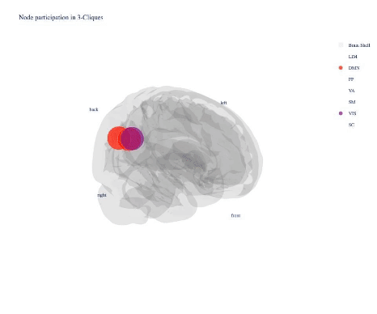

# Emergence of High-Order Functional Hubs in the Human Brain

<p align="center">
  
</p>

This repository contains supporting materials and code for the manuscript entitled "Emergence of High-Order Functional Hubs in the Human Brain," submitted to bioarxiv in https://www.biorxiv.org/content/10.1101/2023.02.10.528083v1. The primary goal of this repository is to demonstrate the computational methods used to analyze high-order dependencies in functional brain networks using multivariate information theory, focusing on resting-state fMRI data, as in our manuscript. It gives instructions on how to compute multivariate information theory metrics, analyse them in the context of uniform hypergraphs, and visualize them. A consequence of our work is that multiple pairwise network metric can be readily extended and computed in uniform hypergraphs. Here, among multiple high-order network metrics, we focused on eigenvector centrality, which allow us to quantify high-order hubs in our work. We also include high-order degree and betweenness centrality analyses in CodeBlock4. 

## Introduction

The human brain's ability to form complex networks and functional hubs is a subject of immense research interest. In our manuscript, after building uniform hypergraphs using multivariate information theory metrics, we delve into the emergence of high-order functional hubs, exploring their significance and potential implications in a clinical context. This repository is a comprehensive guide, providing the necessary tools and code to replicate our analyses and further explore high-order functional brain networks, as well as its visualizations.

To do so, we merged scripts from [@GuillaumeGirier](https://github.com/GuillaumeGirier) and  [@pierrebaudot](https://github.com/pierrebaudot). [Infotopo](https://github.com/pierrebaudot/infotopopy) and  scripts for [computing multivariate interdependencies](https://github.com/GuillaumeGirier/High-Order-Interactions-Python) were included and adapted for this repository. See also [High-Order-interactions
](https://github.com/brincolab/High-Order-interactions) from and 
[@KGatica](https://github.com/KGatica) and [@rcofre](https://github.com/rcofre), from which [@GuillaumeGirier](https://github.com/GuillaumeGirier) have translated to Python. Also to reach this repo, [@danillodbs16](https://github.com/danillodbs16) contributed to the implementation of high-order eigenvector centrality, and we also had discussions and feedback on the implementation with [@eduardacenteno](https://github.com/eduardacenteno), [@taabroeders](https://github.com/taabroeders), [@MCEN-BCAM](https://github.com/MCEN-BCAM), and [@multinetlab](https://github.com/multinetlab). Data visualization has been enhanced from our [network_TDA_tutorial](https://github.com/multinetlab-amsterdam/network_TDA_tutorial) and is also included in this repository.

## Repository Structure

- **CodeBlock1:** [Computation of high-order interdependencies using information theory](/CodeBlock1/Code%20Block%201%20-%20Computing%20High%20Order%20Interdependencies%20in%20HCP%20data.ipynb).

This codebook inputs any time series - in this case - we included an rs-fMRI time series and outputs a CSV file with multiple high-order connectivity metrics for multiple similarities metrics from multivariate information theory, as discussed in our manuscript. That said, the final output is a pandas DataFrame with five columns: One for each Multivariate Metric: Oinfo, Sinfo, Interaction Information (we call in our notebooks as mutual info, since it is a multivariate extension of Mutual Information), and Total Correlation. The last column refer to the indexs of the computed triplets.  


- **CodeBlock2:**  [Computation of phase randomized time series](/CodeBlock2/Phase%20Randomization.ipynb).

Example scripts and explanations were provided for phase randomization of time series, which was used in our work to create surrogate data for our analysis. We applied phase randomization of each time series and computed the multivariate information metrics for each subject, which is stored in a different folder. Then, we compared, at the group level, the statistical distribution of the phase-randomized triplets vs the original ones.  We selected the significant hyperlinks whose weights do not belong to the phase randomized one.

- **CodeBlock3:** [Analyzing real vs. random triplets in a sample of 100 individuals](/CodeBlock3/Code%20Block3%20-%20Hyperedge_selection_real_vs_randomized.ipynb). 
 
Based in the computed high-order interdependencies, this notebook compares randomized and measured high-order interdependencies. Aslo, the notebook outputs include average CSV files for real and randomized data, where the High-order Hubs were computed. Multiple plots comparing phase randomized and measured triplets are shown for each multivariate interdependency metric. 

- **CodeBlock4:** [Network metrics computation and data visualization using provided Data vis code](/CodeBlock4/01_Computing%20and%20Visualizing%20High-Order%20Hubs_thresh001.ipynb).


The 3d data visualization of this material was developed based on the [@network_TDA_tutorial](https://github.com/multinetlab-amsterdam/network_TDA_tutorial) developed at [@multinetlab-amsterdam](https://github.com/multinetlab-amsterdam) by [@eduardacenteno](https://github.com/eduardacenteno) and [myself](https://github.com/fnobregasantos).

- **CodeBlock5:** [Pairwise network analysis and comparison with high-order hubs](/CodeBlock5/Pairwise%20Analysis.ipynb).

  This code block performs a pairwise analysis of different network centralities using the same dataset as the high-order analysis. We selected a significance level of \(p = 0.05\) for the links, based on the correlation between time series of rs-fMRI BOLD activity, to construct the pairwise connectivity matrix. In this analysis, we computed hubs based on Eigenvector Centrality (EC), Degree Centrality (DC), and Betweenness Centrality (BC). Comparing the results, we observed that only visual areas emerged as hubs in the pairwise analysis, whereas the high-order analysis also identified motor areas as hubs. The high-order analysis provides a clearer and more structured identification of hubs, highlighting specific triangles sharing common areas. Detailed results and further analysis on centralities can be found in this code block.


- **CodeBlock6:** High-Order Hubs and relationship with Behavioral and Anatomical Traits This codeblock includes an analysis of high-order triplet data in relation to behavioral and anatomical data from the HCP dataset. **Behavoral and Anatomical HCP Data Privacy:** Given the restriction for publicating clinical data, the results are presented in a markdown file with the python code, with identical results, but no access to individual behavoral and anatomic data. [View the markdown report](CodeBlock6/Triplet_vs_traits_analysis.md)

Each folder contains detailed instructions and scripts necessary for the respective analyses.


## Visualization of High-Order Hubs

The potential visualizations of high-order hubs are extensive, encompassing a wide range of network structures and interactions identified through our analysis. While it is not feasible to display all possible plots directly in this README, we have selected a few key examples and provided them as GIF animations below to illustrate the kinds of patterns observed.

For those interested in exploring the full set of high-order networks, detailed instructions on how to generate and visualize all possible high-order hubs can be found in **CodeBlock4** of this repository. This codeblock includes comprehensive guidance on plotting these networks, enabling further exploration of the rich connectivity patterns uncovered in our analysis.


### Redundant Hypergraphs:

#### Interaction Information

* Hypergraph - animation with 240 frames with the corresponding strongest interaction information as hyperlinks in a hypergraph.

<p align="center">
  
</p>

* High-order hub - animation with the corresponding high-order hubs computed from interaction information as hyperlinks in a hypergraph with 1000 hyperedges

<p align="center">
  
</p>

#### Total Correlation

* Hypergraph animation with 240 frames with the corresponding strongest total correlation as hyperlinks in a hypergraph.

<p align="center">
  
</p>

* High-order hub - animation with the corresponding high-order hubs computed from Total Correlation as hyperlinks in a hypergraph with 1000 hyperedges

<p align="center">
  
</p>

### Synergistic Hypergraphs:

#### Interaction Information

* Hypergraph

<p align="center">
  
</p>

### Additional Animations
Due to size constraints, we are unable to include all possible animations in this repository. However, detailed guidelines on how to visualize an extensive set of hypergraphs can be found in CodeBlock4. 

## Usage and Requirements

### Installation

Before running the project, you need to install the required dependencies. This project uses Python; its dependencies are listed in `requirements.txt`.

To install these dependencies, follow these steps:

1. Using a virtual environment is recommended to keep dependencies for this project separate from other projects. Create a virtual environment named `hoi_env` using Python's built-in `venv` module (or any other virtual environment manager of your choice):

    ```bash
    python -m venv hoi_env
    ```

    This command creates a new virtual environment named `hoi_env` in your project directory.

2. Activate the virtual environment:

    - On Windows:
      ```bash
      hoi_env\Scripts\activate
      ```

    - On macOS and Linux:
      ```bash
      source hoi_env/bin/activate
      ```

    You should now see the name of your virtual environment (`hoi_env`) in your terminal prompt, indicating that the virtual environment is active.

3. Install the required packages:

    ```bash
    pip install -r requirements.txt
    ```

    This command will install all the packages listed in `requirements.txt`.


Now, you are ready to run the project.

## Usage

Detailed instructions on using each code block are provided within the respective folders. It is crucial to follow these instructions for accurate replication of the results.

## Contributing

We welcome contributions and suggestions to improve the code and analyses. Please read through our contribution guidelines before making any changes. 
We welcome contributions and suggestions to improve the code and analyses. This project aims to reproduce the results of our manuscript, but it can also be used to perform other high-order analyses on different datasets.

## Citation

If you use the code or data from this repository, please cite our manuscript:

- [Santos, F. A., Tewarie, P. K., Baudot, P., Luchicchi, A., Barros de Souza, D. A., Girier, G., ... & Quax, R. (2023). Emergence of High-Order Functional Hubs in the Human Brain. bioRxiv, 2023-02.](https://www.biorxiv.org/content/10.1101/2023.02.10.528083v1)

Here are some of the key papers where the data visualisation of this project is based on:

- [Santos, F. A., Raposo, E. P., Coutinho-Filho, M. D., Copelli, M., Stam, C. J., & Douw, L. (2019). Topological phase transitions in functional brain networks. Physical Review E, 100(3), 032414.](https://journals.aps.org/pre/abstract/10.1103/PhysRevE.100.032414).

- [Centeno, E. G. Z., Moreni, G., Vriend, C., Douw, L., & Santos, F. A. N. (2022). A hands-on tutorial on network and topological neuroscience. Brain Structure and Function, 227(3), 741-762.](https://link.springer.com/article/10.1007/s00429-021-02435-0)


## License

This project is licensed under the GNU General Public License v3.0 - see the [LICENSE](LICENSE) file for details.

The GNU General Public License is a free, copyleft license for software and other kinds of works, which permits the use, distribution, modification, and public performance of works that are licensed under it while ensuring that all derivatives of the work are also available under the same license.

## Acknowledgments

- F.A. Santos would like to acknowledge support from Dutch Institute for Emergent Phenomena (DIEP), Institute for Advanced Studies at UvA, Abdus Salam International Centre for Theoretical Physics (ICTP), and Multinetlab (at VUmc) during the development of this repository.


