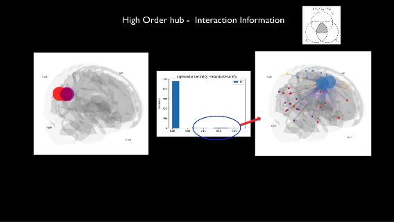

# Emergence of Higher Order Functional Hubs in the Human Brain

  

This repository contains supporting materials and code for the manuscript entitled "Emergence of Higher Order Functional Hubs in the Human Brain," submitted to bioarxiv in https://www.biorxiv.org/content/10.1101/2023.02.10.528083v1. The primary goal of this repository is to demonstrate the computational methods used to analyze high-order dependencies in functional brain networks using multivariate information theory, focusing on resting-state fMRI data, as in our manuscript. 

## Introduction

The human brain's ability to form complex networks and functional hubs is a subject of immense research interest. In our manuscript, after building uniform hypergraphs using multivariate information theory metrics, we delve into the emergence of higher-order functional hubs, exploring their significance and potential implications in a clinical context. This repository is a comprehensive guide, providing the necessary tools and code to replicate our analyses and further explore the intricacies of high-order functional brain networks.

## Repository Structure

- **CodeBlock1:** Computation of high-order interdependencies using information theory. Scripts from [@GuillaumeGirier](https://github.com/GuillaumeGirier) and  [@pierrebaudot](https://github.com/pierrebaudot) [INFOTOPO] [https://github.com/pierrebaudot/infotopopy] were included and adapted to this repository.
- **CodeBlock2:** Computation of phase randomized time series. Example scripts and explanations were provided.
- **CodeBlock3:** Analyzing real vs. random triplets in a sample of 100 individuals. Outputs include average CSV files for both real and randomized data.
- **CodeBlock4:** Network metrics computation and data visualization using provided Data vis code.
- **CodeBlock5:** ClinicalApplication: Correlation analysis between zscores of triplets build from interaction information and gait speed, highlighting the potential of clinical applications of our pipeline.

Each folder contains detailed instructions and scripts necessary for the respective analyses.

## Data Privacy and Ethics

In compliance with the privacy rules of the Human Connectome Project, we cannot publish the computations on individual time series. Therefore, the computations were conducted on anonymized data samples. Additionally, white noise has been added to the anonymous sample to ensure individual privacy. The provided data and results are thus representative but de-identified.

## Requirements

- List of software, libraries, and versions used.
- Installation instructions or setup requirements.

## Usage

Detailed instructions on using each code block are provided within the respective folders. It is crucial to follow these instructions for accurate replication of the results.

## Contributing

We welcome contributions and suggestions to improve the code and analyses. Please read through our contribution guidelines before making any changes.

## Citation

If you use the code or data from this repository, please cite our manuscript:

[Manuscript Title, Authors, Journal, Year]

## License

This project is licensed under the [License Name] - see the LICENSE file for details.

## Acknowledgments

- Mention collaborators, funding agencies, or any other support received.

---

# Emergence-of-High-Order-Hubs-in-the-Human-Connectome
This repository has the relevant codes associated with the manuscript: Emergence of High Order Hubs in the Human Connectome. It gives instructions on how to compute multivariate information theory metrics, and how to analyse it in the context of hypergraphs, and how to visualize it.

## Data - Since HCP data is sensitive, we use a sample timeseries data.

## Code Block 1: High Order connectivity from timeseries

input: Any time series - in this case, we included a rs-fMRI time series.
output: A csv file with multiple high order connectivity metrics for all similarities metrics discussed in our manuscript.

Notice that those similarity metrics were created combining codes from multiple sources, and for our manuscript we used the codes developed in Guillaume and Pierre, combined int in the infotopo_server.py file.

That said, the final output is a pandas DataFrame with a column for each Multivariate Metric, namely, Interaction Information, Total Correlation, Oinfo, and Sinfo. 

## Code Block 2: Statistical selection of High Order links. 

We have a folder with the computed High Order connectivity for all subjects. We will use this folder to have a group level measure for the statistical selection of High Order links. We did phase randomization of each timeseries, and computed the same metrics for each subject, which is stored in a different folder. Then we ccompared, at group level, the statistical distribution of the phase randomized triplets vs the original ones.  We selected the hyperlinks that were significant in at least 95% of the subjects.

### Step 1: Loading all High Order Connectivity

### Step 2: The second Block will actually compute High order connectivity. First I will do everything at the average level. Therefore I need:

#### 1) Load all files from dropbox somehow. 
#### 2) Create the average High Order connectivity for the whole cohort. 
#### 3) Run the high-order connectivity script for everything.
#### 4) Eventually Store all HIgh order Hubs in a Dataframe (Brainstorm this a bit more).

## Code Block 3: Data Visualization of High Order Hubs in the Human connectome.

Upload of my current working code on it. It's so detailed that I will make more steps in it while doing it.

## Code Block 4: Run High Order metrics in the whole cohort.

The same has code block 3: I will be inspired by the codes I made for Rodrigo Cofre. 

